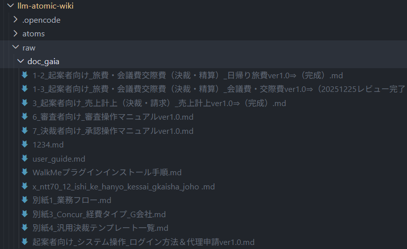
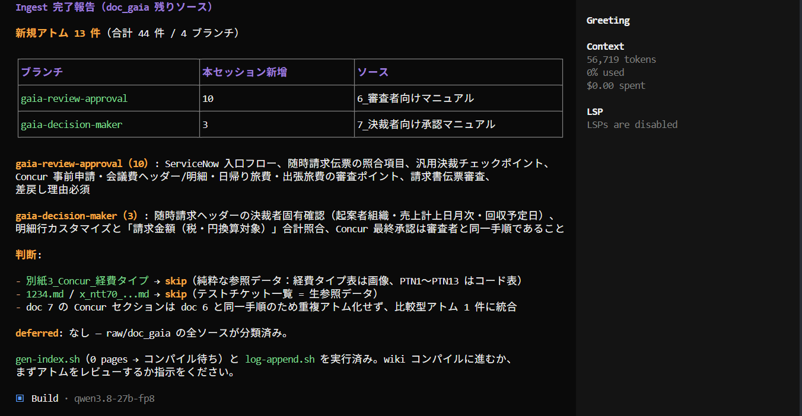
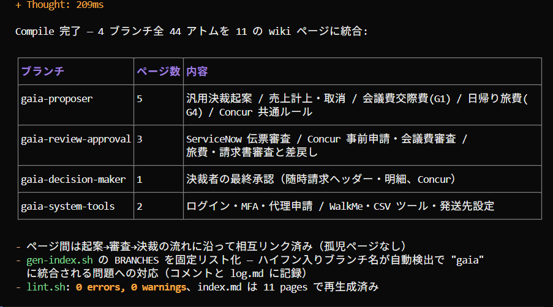
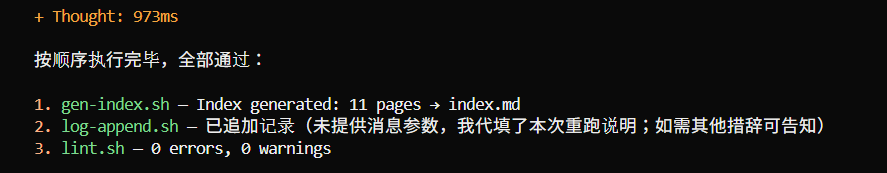
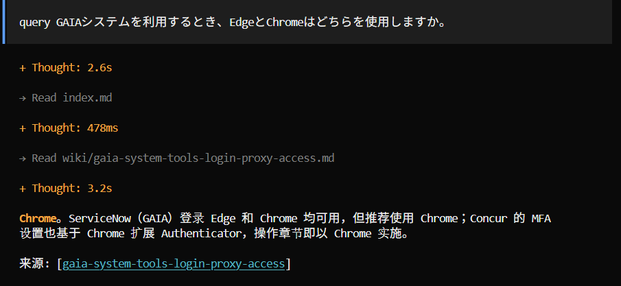
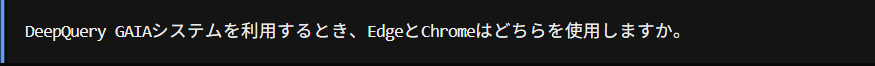
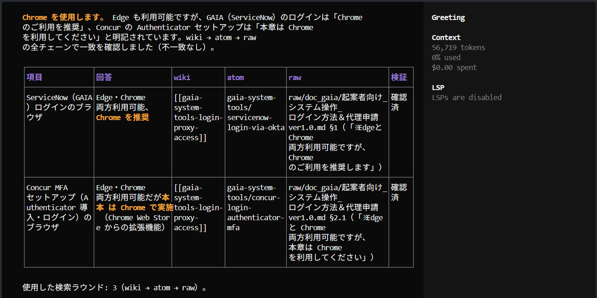

# 操作実例：具体的な操作手順


## ステップ 1：必要なファイルの事前準備

### 手順
1. **下記ファイル参考して、DevContainerに接続する**

[DevContainer接続](https://gitlab.genai.infotech-park.com/genai/start-genai/-/blob/main/docs/reservation_system.md)

2. **gitlabからファイルを取得する**

自分の作業ディレクトリに移動し、下記コマンド利用して、gitlabから、必要ファイルを取得する。
   ```bash
   git clone https://gitlab.genai.infotech-park.com/genai/llm-atomic-wiki.git
   ```
- 上記コマンド実行する時、gitlabログイン画面が表示される場合は、メールアドレスとパスワードを入力すれば、正常に実行できます。

3. **.envファイル内容修正**

.envファイルのOPENCODE_CONF、OPENCODE_AUTH、REPO_HOST_DIRの値を下記参照して修正ください。

 ```bash
  REPO_HOST_DIR=/workspace/<コンテナ名>/<作業ディレクトリ>/llm-atomic-wiki

  OPENCODE_CONF=/workspace/<コンテナ名>/<作業ディレクトリ>/llm-atomic-wiki/.config/opencode/opencode.json
  OPENCODE_AUTH=/workspace/<コンテナ名>/<作業ディレクトリ>/llm-atomic-wiki/.local/share/opencode/auth.json
   ```

   ```bash
   実例：
  REPO_HOST_DIR=/workspace/container_201/kokisou/llm-atomic-wiki

  OPENCODE_CONF=/workspace/container_201/kokisou/llm-atomic-wiki/.config/opencode/opencode.json
  OPENCODE_AUTH=/workspace/container_201/kokisou/llm-atomic-wiki/.local/share/opencode/auth.json
   ```

4. **基本ファイルの事前準備**

基本資料を**llm-atomic-wiki/raw/<自分で作成したフォルダ>**フォルダに投入する。


5. **コンテナ構築し、opencodeを起動する**

下記コマンドを利用して、コンテナを構築する

```
cd /workspace/<作業ディレクトリ>/llm-atomic-wiki
docker compose up -d --build
```

下記コマンドを利用して、oepncodeを起動する
```
docker exec -it llm-atomic-wiki bash
opencode
```

---

## ステップ 2：WIKI作成と使用

1. **AGENTを利用して、Ingestを実行する**

以下の文章をダイアログに入力し、AI を利用して、指定したディレクトリ配下のファイルに対して ingest 処理を実行します。
```
raw/doc_gaia 配下のファイルに対して ingest 処理を実行します。対象ブランチは /atoms/<自分で作成したディレクトリ>/とします。
```
- 対象ブランチを指定しない場合、OpenCode からいくつかの推奨方法が提示されるため、その中から推奨された方法を使用してください。


2. **AGENTを利用して、Compileを実行する**

以下の文章をダイアログに入力し、AI を利用して、指定したディレクトリ配下のファイルに対して compile 処理を実行します。
```
atoms/<作成したフォルダ> 配下のファイルに対して compile 処理を実行します。
```


3. **スクリプトを実行します**

```
gen-index.sh、log-append.sh、lint.shの順番で各スクリプトを実行します。
```


4. **クリアを実行します**
提供した資料について、いくつか質問することができます。
a.query方式


b.DeepQuery方式




---

